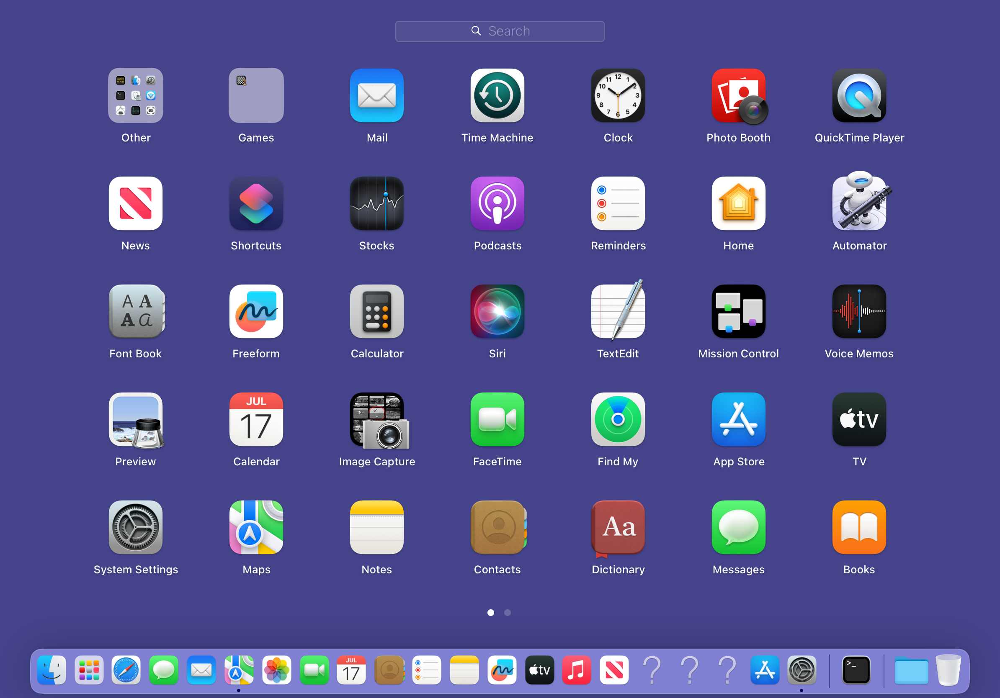
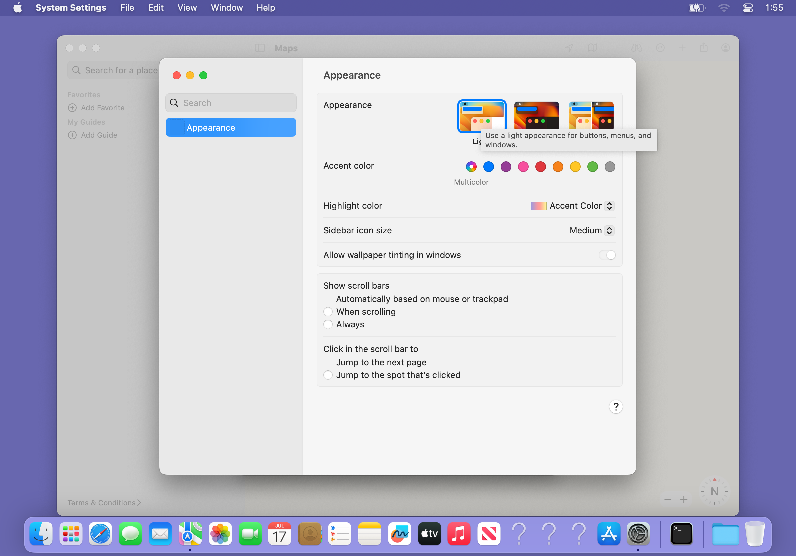
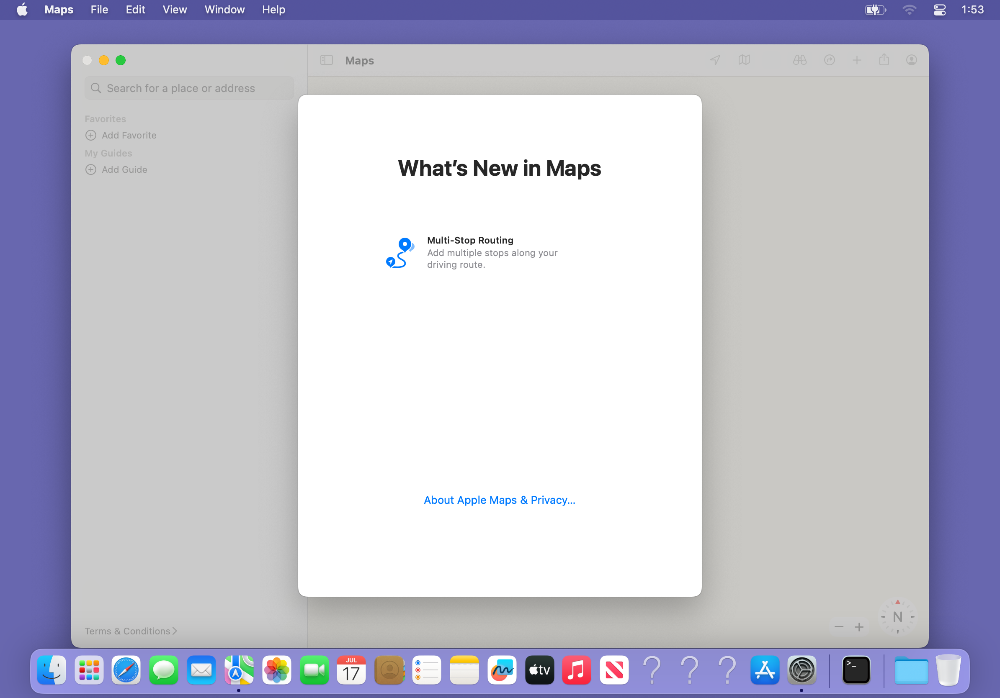
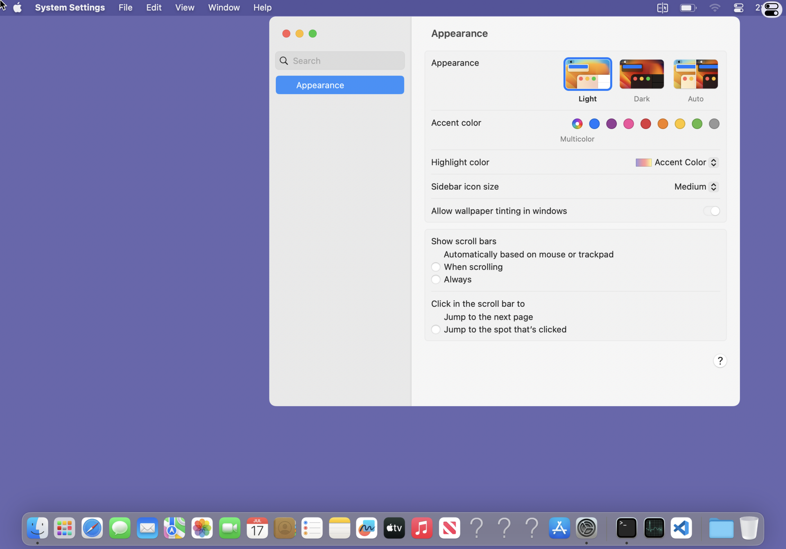
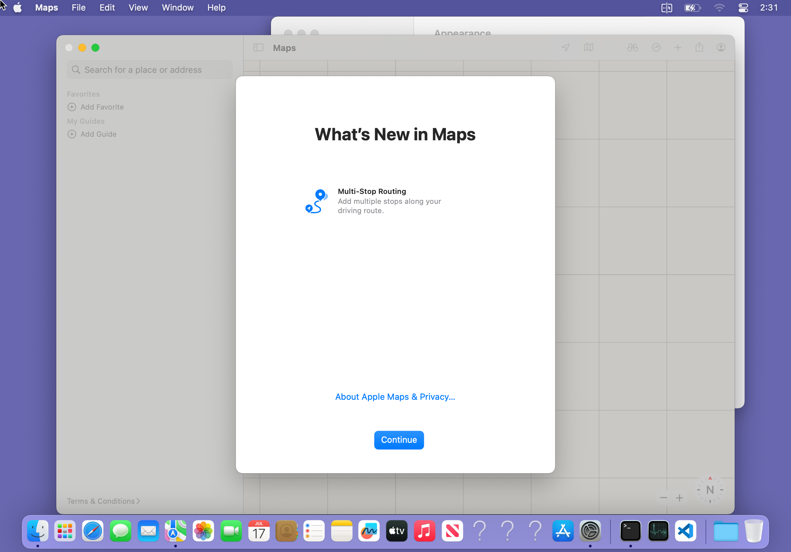
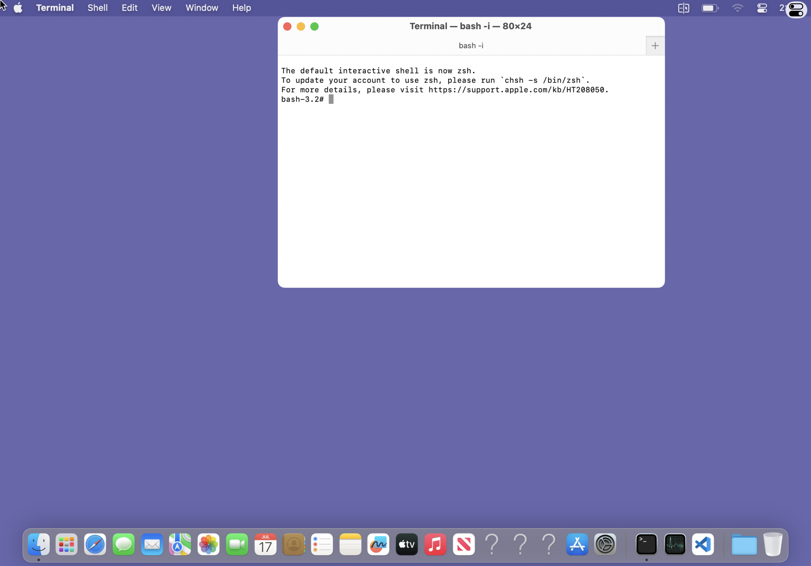

# Launchpad, System Settings and Maps production milestone (2026-08-04)

This milestone was validated on the iPadOS 16.3.1 iPad13,6 target with the
production native-AGX DisplayStream stack. No MTLSim path was enabled and no
device reboot or SpringBoard restart was used during the final validation.

## Launchpad is populated

The empty Launchpad was not an icon-grid or database-result problem. Runtime
tracing of Dock's stock importer showed its source validation comparing the
chroot-visible application directory with `fstatfs(2)`'s host mount name. The
kernel returned `/var/mnt/rootfs` for the macOS filesystem even though the
process sees that same filesystem at `/`. `libmachook` now rebases only this
filesystem identity for Dock/LaunchServices callers. The stock importer then
reported `apps=63`, `items=76` without forcing an import-success result.

The final production command was:

```text
sudo bash /var/jb/usr/macOS/bin/macos_gui.sh launchpad
[launchdchrootexec] target=/usr/local/bin/macwsworkspacectl arch=arm64 insert=/usr/local/lib/libmachook_arm64.dylib
```

The VNC witness shows the real Launchpad page populated with Ventura apps,
including System Settings and Maps:



## System Settings runs its real Appearance extension

System Settings launches through the normal MacWS Host application API. Its
visible page is the stock Ventura `Appearance.appex`, hosted by the real
ExtensionKit/ViewBridge service chain rather than a replica panel.

Final runtime output:

```text
ok=yes launched-pid=67656 message=已启动 system-settings，AppKit 窗口已进入 DisplayStream 列表
window pid=67656 id=133 layer=0 onscreen=yes alpha=1 name=Appearance bounds={
    Height = 625;
    Width = 715;
    X = 239;
    Y = 87;
}
window-count pid=67656 count=5
```



The underlying repairs preserve the stock extension contract: a freestanding
iOS first image enters the chroot before libSystem consumes the one-shot XPC
launch context, then execs the real macOS extension. Dedicated ExtensionKit
and Appearance entitlement profiles, bundle-local `libmachook` dependencies,
and reboot-volatile trustcache restoration are installed idempotently by
`ensure_appearance_runtime.sh` and both package postinstall paths.

## Maps uses a persistent UIKit carrier and a real FrontBoard identity

The original `POSIX_SPAWN_SETEXEC` carrier was not stable. Runtime evidence in
`/tmp/maps-run-20260804-040920.clean.log` was exact:

```text
SpringBoard ... Workspace connection invalidated.
Now flagged as pending exit for reason: workspace client connection invalidated
```

Keeping the real iOS `UIApplication` carrier alive and spawning Maps as a
separate chroot child removed that lifetime failure. The first child attempt
still had no scenes; `/tmp/maps-child-20260804-041511.clean.log` showed the
actual rejected identity:

```text
runningboardd: Resolved pid 70077 to [anon<Maps>:70077]
UIKitSystem: Client connected ... [anon<Maps>:70077]
Ignoring non-application [anon<Maps>:70077]
Denying scene request ... Client is not a UIKit application
```

Project LLDB against the loaded Ventura 13.4 FuseBoard image RE-confirmed the
exact identity boundary. The stock
`+[RBSProcessHandle(FuseBoard) fu_handleForIdentifier:]` does the following:

```text
0x224f843f8 <+60>:  bl 0x224fa65a0 ; objc_msgSend$fu_versionedPID
0x224f8443c <+128>: bl 0x224fa6620 ; objc_msgSend$handleForIdentifier:error:
0x224f84468 <+172>: bl 0x224fa65a0 ; objc_msgSend$fu_versionedPID
0x224f84470 <+180>: subs x8, x8, x0
0x224f84478 <+188>: tbnz w8, #0x0, 0x224f84498
```

`libmachook` therefore repairs this provider boundary only when all of these
conditions hold:

- the PID resolves to the exact live chroot Maps executable;
- UIKitSystem already constructed and cached a handle from the child's real
  audit token;
- the complete requested and cached versioned PIDs match;
- the cached handle still answers the native `fu_isApplication` predicate.

Every other process and every stock mismatch path retains the original result.
No assertion, application predicate, or scene-acceptance check is forced.

Final cold production launch through `macwshostd`:

```text
ok=yes launched-pid=270 message=地图已通过 UIKitSystem 启动，原生窗口已进入窗口列表
  257     1 root   Ss   0.0 00:10 .../UIKitSystem system_app_start
  265     1 mobile Ss   0.0 00:10 .../MacWSCatalystLauncher
  270   265 root   S   11.8 00:10 .../Maps.app/Contents/MacOS/Maps
window pid=270 id=156 layer=0 onscreen=yes alpha=1 name=Maps bounds={
    Height = 721;
    Width = 1024;
    X = 85;
    Y = 53;
}
window pid=270 id=157 layer=0 onscreen=yes alpha=1 name=Untitled bounds={
    Height = 600;
    Width = 482;
    X = 356;
    Y = 113;
}
window-count pid=270 count=2
```

The three-process chain remained alive after 6 minutes 38 seconds. The final
iPad sample was `thermal-state=nominal` with effective temperature 33.29 C.
Fresh UIKitSystem/Maps/carrier log ranges contained no `#### CATALYST` lines
with `MACWS_CATALYST_TRACE` absent.



`MACWS_CATALYST_REGISTER_APPLICATION=1`,
`MACWS_CATALYST_REQUEST_INITIAL_SCENE=1` and the private FrontBoard endpoint
name are scoped to the hidden Maps carrier child. `MACWS_CATALYST_TRACE`
remains off in production.

## Late cold revalidation: no empty Settings, no black Maps, real iPad fullscreen

The three user-visible regressions reported later on 2026-08-04 were reproduced
against the installed production stack and fixed at their owning lifecycle or
ABI boundary. The final clean macOS-host-built package SHA-256 is
`ebc05b6fb58463118ab0d6b413d0d05901b2211dcabf3629d82b0fd85b00fa67`.
No iPad reboot was performed. The final package validation did not respring
SpringBoard; it only allowed the package manager to replace/relaunch MacWS Host
and restarted the dedicated `macwshostd` launch job.

### System Settings launch success requires a fresh window generation

The empty Settings report was reproduced with main process PID 30163. The real
CGWindow catalog contained zero windows, while
`macws_window_metrics.30163.bin` still contained a generation-5 Visible entry
last written at 16:47. The old launcher accepted that stale sidecar and returned
success without a window.

The native reopen transaction is now also a liveness handshake:

1. `macwshostd` records the current metrics generation.
2. It sends `MacWSInputKindReopenApplication` to the exact target PID.
3. AppInputBridge executes AppKit's real `_handleAEReopen:` path and forcibly
   publishes one new metrics generation, even when the window bytes are
   otherwise unchanged.
4. The launcher accepts success only when the generation advanced and the new
   record contains a real Visible level-0 window. A stale PID is retired before
   the normal cold launch path is entered.

The deliberately windowless old process failed that handshake and was retired.
The replacement process produced this runtime-confirmed transaction:

```text
application-reopen pid=30163 result=no-appinput-endpoint
launch-app windowless-retired pid=30163 ... after=KILL
launch-app id=system-settings pid=37325 ...
application-reopen pid=37325 sent=YES errno=0
application-reopen pid=37325 result=window-ready previous-generation=0 current-generation=2 exit-status=-1
launch-app window-ready id=system-settings pid=37325 path=DisplayStream
```

The macOS CGWindow postcondition then contained the visible stock extension:

```text
window pid=37325 id=33 layer=0 onscreen=yes alpha=1 name=Appearance
    Height = 592; Width = 715; X = 409; Y = 25;
window-count pid=37325 count=5
```



### Maps needed native-AGX ABI and arm64e Foundation-boundary repairs

The black Maps window was not a Catalyst identity failure. Two subsequent
crashes were isolated with the actual loaded binaries:

- Runtime LLDB showed the external AGX stub at static `0x1e5a5dfc0` is normally
  rewritten to an absolute `objc_msgSendSuper2` branch. Maps reached
  `-[AGXG13GFamilyDevice initWithAcceleratorPort:simultaneousInstances:] +232`
  before the previous late repair point and failed pointer authentication.
  `libmachook` now repairs that exact four-instruction stub immediately after
  deriving the AGX image slide, verifies the original bytes and readback, and
  fails closed before any AGX Objective-C work if it cannot establish the
  invariant.
- The next crash was runtime-confirmed at
  `-[AGXG13GFamilyRenderContext updateFence:afterStages:] +124` with `x19=0`;
  the faulting instruction was `ldrh w1, [x19, x8]`. Disassembly of the actual
  Ventura 13.4 IOGPU showed fence create/destroy selectors `0x16/0x17`, while
  the actual iPad13,6 iOS 16.3.1 IOGPU image uses the same scalar ABI at
  selectors `0x12/0x13`. The selector translator now maps only those two exact
  operations. It does not fabricate a fence or bypass validation.
- A final device-linked package then reproduced a distinct PAC fault in
  `-[NSBundle initWithPath:]`. Crash report
  `Maps-2026-08-04-172524.ips` records
  `0x00200001eed885e8`, the unauthenticated
  `__CFConstantStringClassReference`, with the exact stack
  `getMetalPluginClassForService -> +[NSBundle bundleWithPath:] ->
  -[NSBundle initWithPath:]`. The AGX bundle path and `ds.g13g` resource names
  are now constructed by the live Foundation runtime from C strings. This
  removes the invalid arm64e constant-object relocation at its consumer
  boundary; no PAC check or exception is bypassed. The final package was
  rebuilt cleanly with the Mac host's ld64.

After those repairs, the final-package cold Maps PID 47337 published two real
visible windows:

```text
window pid=47337 id=41 layer=0 onscreen=yes name=Maps bounds=1024x724
window pid=47337 id=42 layer=0 onscreen=yes name=Untitled bounds=482x600
window-count pid=47337 count=6
```

The dedicated Catalyst reuse path now also requires a native reopen response
and a strictly newer metrics generation; it no longer accepts an old Visible
sidecar. The live process produced this postcondition on the second Control
Center launch:

```text
application-reopen pid=47337 sent=YES errno=0
application-reopen pid=47337 result=window-ready previous-generation=4 current-generation=5 exit-status=-1
launch-app reuse id=maps pid=47337 route=UIKit-carrier
```

The first-run sheet and map canvas are visibly rendered here after the final
clean package; this is a true 2388x1668 RFB capture:



### Fullscreen is one live Scene, not a black bootstrap survivor

The SpringBoard maximization transaction already reached 1389x970, but the
wrong Host Scene survived. Runtime logs showed the exact failure sequence: the
Scene that had received the 2388x1668 IOSurface first frame was discarded after
its remembered *return* window PID exited, and the delayed disconnect callback
then also sent a close for the AppKit window despite the preserve decision.
The remaining bootstrap Scene intentionally had no display subscription, so it
looked like a black fullscreen window.

Fullscreen desktop ownership is now independent from its optional return
window. A dead return PID only clears the back-navigation identity; it cannot
destroy the desktop compositor subscription. Restored fullscreen sessions no
longer run the bootstrap-Terminal path, an empty first-launch placeholder is
replaced in place by the first real window, and discard/disconnect share one
idempotent preserve transaction.

The cold Host reconnect produced all required postconditions together:

```text
scene-geometry ... bounds=1389.0x970.0
display-stream first-frame ... 2388×1668 · DisplayStream · IOSurface 直传
runtime-confirmed native Metal present ... drawable=2388x1668 content=(0.00,0.00 1389.00x970.00)
immersive-postcondition ... status-hidden=YES home-indicator-auto-hide=YES deferred-edges=15
scene-maximization UIKit-observation ... fills-screen=YES bounds={{0,0},{1389,970}} screen={{0,0},{1389,970}}
```

The Host-side Metal snapshot visibly contains the complete macOS desktop,
menu bar and Dock. Its 2778x1940 backing image has no iOS status bar or Home
Indicator:



The final safety sample was `thermal-state=nominal`, effective temperature
33.39 C, with both rootful and rootless Safe Mode flags absent. No Maps,
System Settings, Appearance, MacWS Host or SpringBoard crash was created after
installing the final package.

## Known limitation

The first-run “What's New in Maps” sheet can now be completed, Ventura geod
loads populated map tiles, and the native-to-Ventura CoreLocation bridge shows
the current-location marker. Those later provider and GeoServices results are
documented separately in
[`maps-location-geoservices-20260804.md`](maps-location-geoservices-20260804.md).
This milestone does not claim coverage for every Maps feature such as route
guidance, traffic updates or account-backed Guides.
