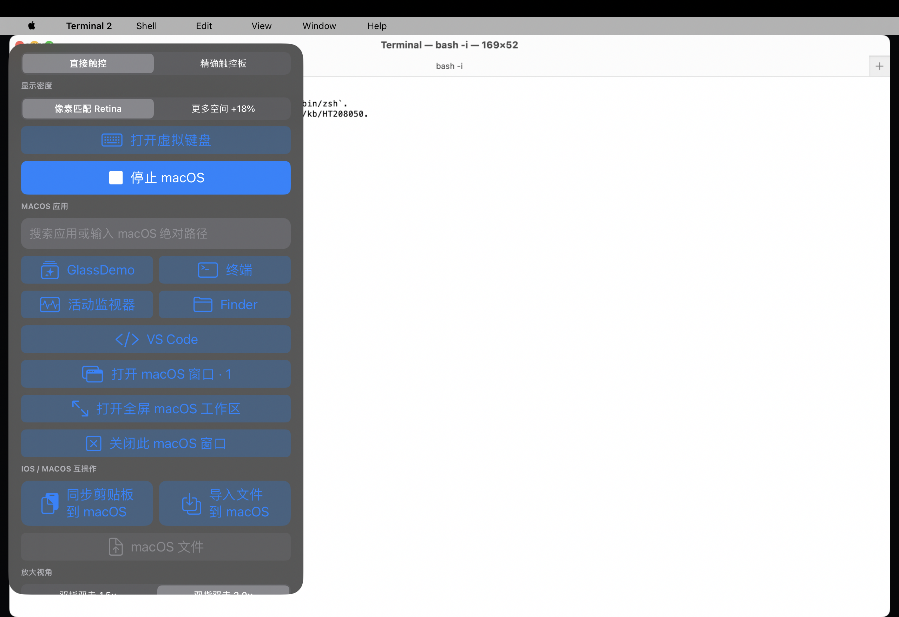

# DisplayStream Host UX milestone — 2026-08-01

This record covers the production MacWS Host build implementing scroll-first
direct touch, hold-then-drag, the touch/trackpad pointer split, dynamic
pixel-matched Retina density, the restored fullscreen-workspace control, and
aspect-preserving Scene geometry.

## Build and pure tests

Commands run on the development Mac:

```text
gmake -C MacWSHost clean all FINALPACKAGE=1 STRIP=0 \
  THEOS_PACKAGE_SCHEME=rootless GO_EASY_ON_ME=1
cc -std=c11 -Wall -Wextra -Iinclude misc/macws_protocol_test.c \
  -lm -o /tmp/macws_protocol_test
/tmp/macws_protocol_test
git diff --check
```

Results:

```text
Making all for application MacWSHost…
Compiling main.m (arm64)…
Linking application MacWSHost (arm64)…
Signing MacWSHost…
macws protocol validators: PASS
```

The only compiler warnings were the pre-existing deprecated
`kIOSurfaceIsGlobal` reference and unused `macws_log_write` in
`misc/iosclear_ref.m`; `MacWSHost/main.m` produced no warnings.

## Production deployment identity

The installed iPad binary and the final local artifact had the same SHA-256:

```text
6694fd92a4b158d8cf4b416f1faab94dd8b043c96a1d22244cede58ddb441c92
```

Only MacWS Host was replaced/relaunched. WindowServer, VS Code, displayd,
inputd, and the macOS GUI session were not restarted. The original Host app
was retained under `/var/jb/var/mobile/MacWSHost.app.before-retina-gestures-20260801`.

Production state after deployment:

```text
input-mode-default=1
diag-flag=OFF
crashes=0
thermal-state=nominal raw=0 low-power=no
battery-temp-centic=3729 effective-temp-centic=3729
```

## Runtime geometry witness

The final installed binary emitted this completed Metal-present witness:

```text
runtime-confirmed native Metal present scene=11594a273c200ead
frame=1728x1302 backing=2.000 drawable=1726x1302
content=(0.00,0.58 1004.00x755.84) density=1.16
source=IOSurface status=4 error=nil
```

This is runtime confirmation that the final binary presented a valid
IOSurface, recomputed the density to `1.16`, matched the drawable height, and
bounded horizontal rounding to two physical pixels rather than stretching the
frame.

The immediately preceding build used the identical geometry implementation;
the final build only added handling for a terminal coalesced-touch sample in
the long-press drag state machine. That geometry revision also emitted this
bounded resize-convergence witness:

```text
runtime-confirmed native Metal present scene=f5850dbd6298dddf
frame=2054x1302 backing=2.000 drawable=2053x1302
content=(0.00,0.58 1194.00x756.42) density=1.16
source=IOSurface status=4 error=nil
```

Before AppKit applied that new frame, the valid previous `1728x1302` surface
was shown at `1004.98x757.00` points with side margins instead of being
stretched.

The read-only CoreGraphics catalog then confirmed the AppKit side accepted the
corresponding logical size:

```json
{
  "window": 434,
  "pid": 57563,
  "name": "Terminal — bash -i — 145×42",
  "onscreen": true,
  "bounds": [167.0, 25.0, 1027.0, 651.0]
}
```

At backing scale 2, `1027x651` logical points produce `2054x1302` pixels.

## Visual witness



The screenshot is a native 2560x1760 capture. SHA-256:

```text
d57d0aa87ed11bd45464b63deebf405ccda32a7e5636d4cf87db3f8b211f10f2
```

It visibly confirms the production default is direct touch, the density
choices are `像素匹配 Retina` and `更多空间 +18%`, the fullscreen-workspace
button is present, and the current macOS window remains proportionally fitted.

## Evidence boundary

The state-machine boundaries and complete arm64 Host build are automated here.
Real UIKit finger count, long-press timing, two-finger scrolling, physical
rotation, and Stage Manager drag gestures cannot be synthesized by the SSH
harness without replacing the input source being tested. They remain manual
on-glass acceptance checks; failures must be captured as input records and
surface/Scene geometry, not treated as disproving the build witnesses above.
