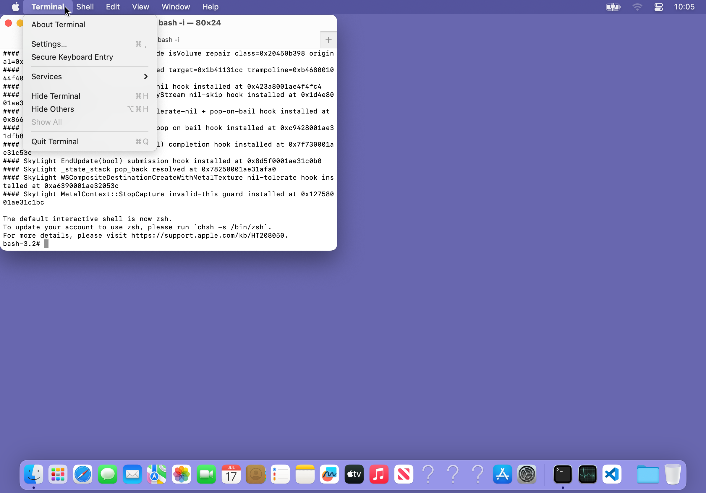
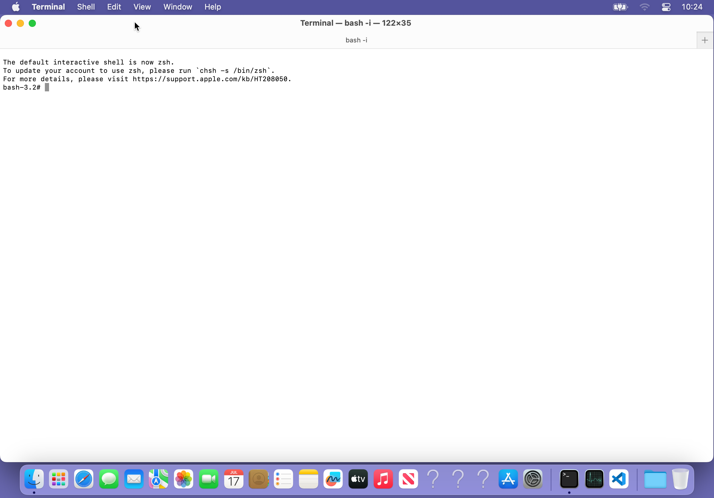
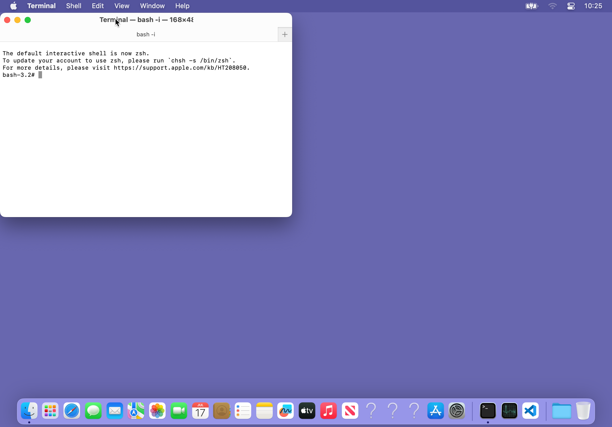
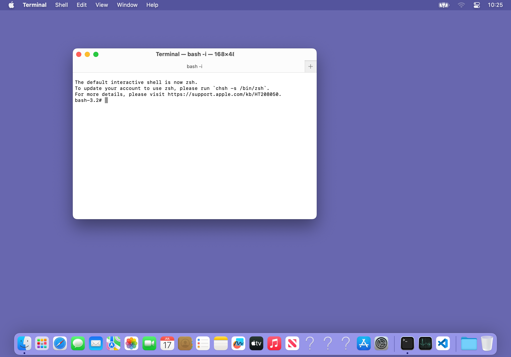
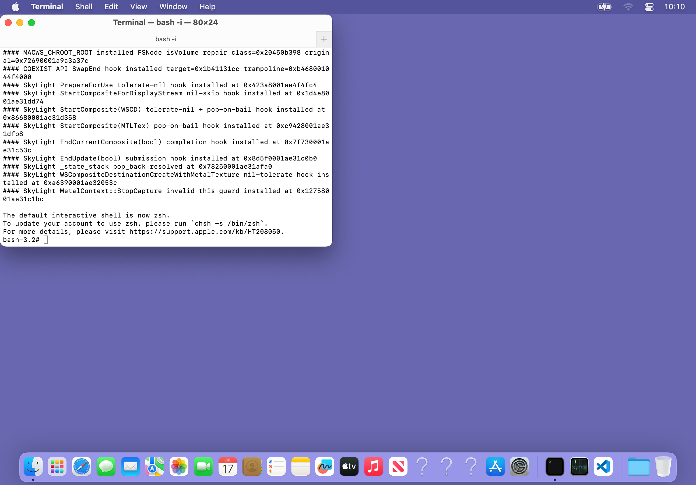

# DisplayStream input, menus, gestures and Dock — 2026-08-06

This milestone removes several shared input/display lifecycle failures in the
fullscreen MacWS Host.  It does not add application-coordinate exceptions.
The fixes derive routing from the live DisplayStream graph and macOS's real
CGWindow/AppKit state.

## Root fixes

### Cursor is visible but never an input target

Runtime before the fix showed a touch at physical `(220,24)` resolving to
WindowServer's cursor window rather than the menubar beneath it.  displayd now
marks cursor-level layers with `MacWSStreamFrameInputPassthrough`; Host still
Metal-composites those layers but omits them from exact-graph hit testing.

This is the systemic explanation for controls becoming unclickable only while
the pointer happened to cover them.  The post-fix route for the same menubar
point is runtime-confirmed:

```
MACWS-INPUT SLS-ROUTE point=(110.00,12.00) connection=96551 pid=2251 window=15 depth=1/1
MACWS-INPUT ROUTE seq=6 route=appkit-socket pid=2251 window=15
```

The capture catalog described that same window as WindowServer-owned.  Inputd
therefore treats the CGWindowID—not the producer PID—as the stable identity
when WindowServer hands a shared system surface to the active AppKit
connection.  A different nonzero window is still rejected as stale.


### Native popup dismissal and immediate layer retirement

An open native popup owns the next primary click even when that click falls
outside its rectangle.  inputd now confirms an on-screen
`kCGPopUpMenuWindowLevel` window and routes that click to its current owner.
This also handles Dock handing its context menu to DockHelper.  A stale timeout
alone is never allowed to steal a later independent click.

The Terminal outside-click witness is:

```
MACWS-INPUT SYSTEM-MENU-CAPTURE requested=2251/15 verified=629/17 point=(600.00,350.00)
MACWS-INPUT ROUTE seq=7 route=appkit-socket pid=2251 window=15
```

Every completed semantic AppKit click now sends a display-catalog invalidation.
displayd samples transient windows on a bounded 50 ms urgent cadence while a
real popup is present, then requires two independent absent snapshots before
retiring it.  Host tombstones the layer immediately and rejects late frames
from its retiring stream.  This removes the seconds-long semitransparent menu
ghost without fabricating opacity or deleting a window still reported by
macOS.



### Stable hold-drag and native titlebar double click

A direct touch remains scroll-first until the hardware timestamp reaches the
0.45 s hold boundary.  Once a hold becomes a drag, Host freezes the original
layer descriptor for the entire down/move/up transaction.  A window's own
movement can no longer be fed back into the next local coordinate and make it
oscillate around the finger.  Cursor pass-through also removes pointer-shaped
dead zones from VSCode and other titlebars.

Two direct-touch taps are paired by UIKit hardware time and distance even when
the first click changes macOS focus.  AppInput invokes the real
`-[NSWindow zoom:]` action on a native titlebar; it does not synthesize a green
traffic-light click.  On the live 2388x1668 desktop, the same Terminal window
was maximized, restored, and then moved from the upper-left to the desktop
centre with one down/move/move/up transaction while WindowServer PID 10304
remained unchanged.







### Fullscreen three-finger gestures

Host installs one exact-three-direct-touch recognizer only in fullscreen mode.
The pure `MacWSClassifyThreeFingerPan` policy is shared with the local protocol
test:

- left/right maps to the standard Control+Right/Left Space commands;
- up opens Host's all-window overview;
- down opens the current application's window overview;
- ambiguous diagonals do nothing, while a decisive short flick remains valid.

The vertical path deliberately does not post Control+Up to this headless
WindowServer.  A previous runtime attempt reached Metal Performance Shaders
and produced `Internal Error (00000103)` followed by
`OS_REASON_COREANIMATION`.  Host's overview consumes the authoritative live
window catalog and preserves the MacBook gesture vocabulary without repeating
that known compositor failure.

### Dock launch and context-menu ownership

Dock's real surface routes to Dock rather than a borrowed AppKit endpoint.  A
native right click produced a separate DockHelper popup and left Dock alive:

```
MACWS-DISPLAY layer-start stream=14 base=0 layer=26 level=11 owner-pid=7330 owner=DockHelper name= skylight-layer=101 destination=(1848,1032 528x510)
MACWS-DISPLAY workspace-layer-remove layer=26
MACWS-DISPLAY layer-retire-begin layer=26 reason=workspace-catalog-removed grace-ms=5000
MACWS-DISPLAY layer-retire-complete layer=26 reason=workspace-catalog-removed
```

Dock launches are forwarded by bundle path to hostd.  VS Code 1.130 exposes
`Contents/MacOS/Code`, whereas the old mapping recognized only `Electron` and
fell into the unsupported custom-path launcher.  Both executable identities
now select the production AGX/JIT VSCode profile.  The exact before/after
runtime lines are:

```
MACWS LS-APP-FALLBACK path=/Applications/Visual Studio Code.app launched=NO reply=custom-path 在发布 AppKit 窗口前退出（状态 1）
MACWS LS-APP-FALLBACK path=/Applications/Visual Studio Code.app launched=YES reply=VS Code 已通过生产 AGX/JIT 配置启动，窗口已进入列表
```



## Validation and production boundary

- `clang -std=c11 -Wall -Wextra -Werror -Iinclude
  misc/macws_protocol_test.c` passes, including touch thresholds,
  three-finger direction/flick boundaries and the cursor pass-through flag.
- Python input/RFB tools compile with `py_compile`; production shell scripts
  pass `bash -n`; `git diff --check` is clean.
- A clean Mac-side `gmake ... FINALPACKAGE=1 STRIP=0 OPTFLAG=-O2 package`
  built every target, including Host, inputd, displayd, hostd and
  DockHelperProxy.  Package SHA-256:
  `73764b5cb9661b7321c291207dd1d44b06098b3ea6d868169584be82518a3890`.
- The rebuilt Host was deployed without respringing or restarting
  WindowServer.  The final device thermal sample was `nominal`, 36.79 °C.

## Open stability evidence

One earlier VSCode popup-close run ended in an automatic WindowServer abort.
The watchdog recovered PID 91623 as PID 10304.  The final lines do not contain
an abort backtrace, so the input/display changes are **not** claimed as the
cause.  The nearest concrete GPU evidence in that session is:

```
Error: command buffer exited with error status.
The Metal Performance Shaders operations encoded on it may not have completed.
Internal Error (00000103:Internal Error)
<AGXG13GFamilyCommandBuffer ... label com.apple.SkyLight>
```

This remains a compositor-stability investigation.  It is kept separate from
the input claims above, whose witnesses are completed native actions, visible
pixels and unchanged post-test process IDs—not process uptime alone.
