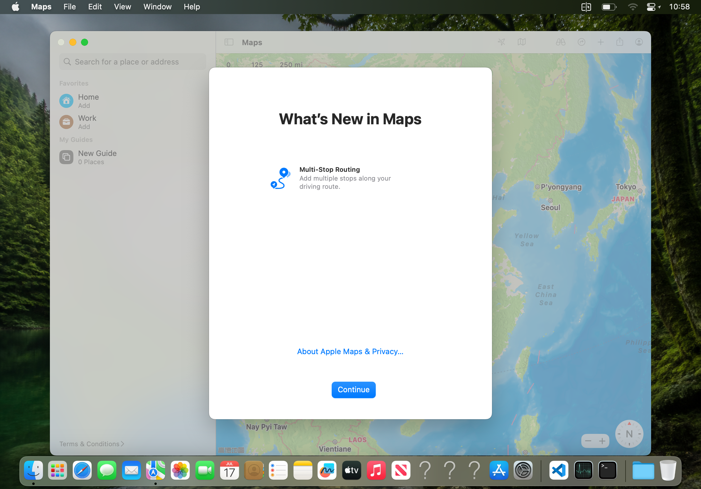
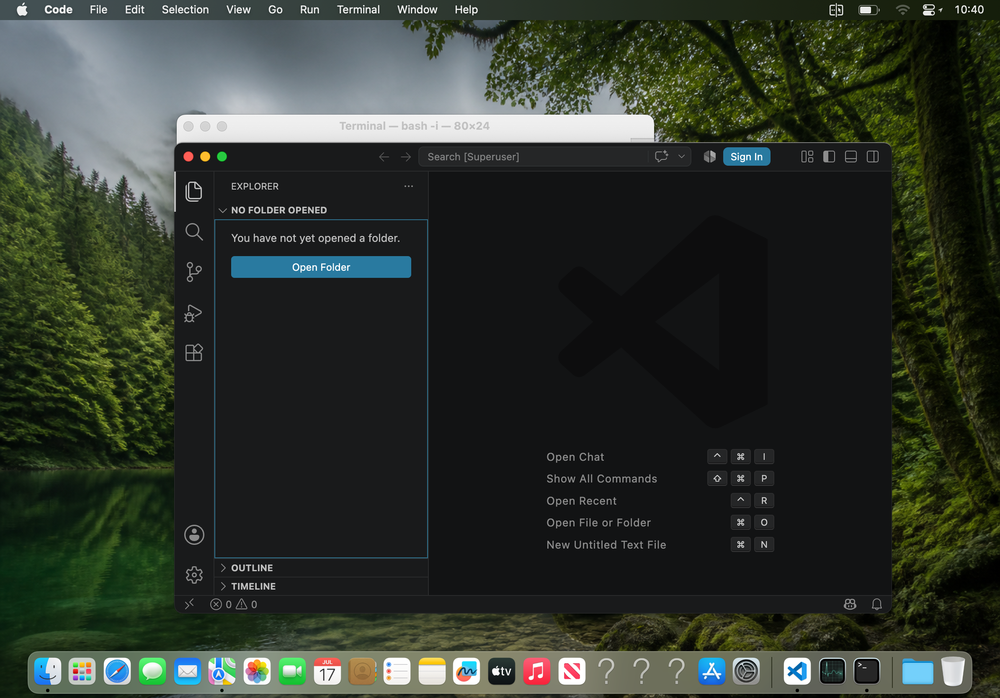
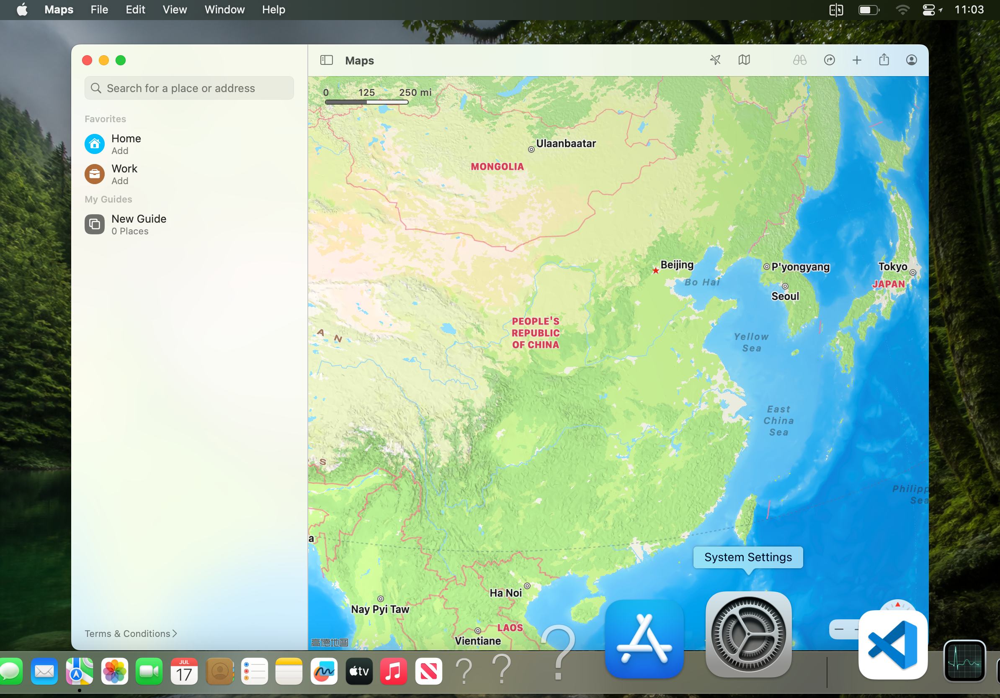

# Maps lifecycle, forest wallpaper, Dock magnification and edge drag

Date: 2026-08-09

Device: iPad13,6, iPadOS 16.3.1, production AGX-native fullscreen workspace

Package: `com.kdt.macosbooter_0.3.4_iphoneos-arm64.deb`

Package SHA-256: `a80635fad8fa34ad1e45ccb57d0afd611c805441a531d784f461263cbc92df46`

## Maps: observed failure and recovery invariant

This change does not claim to repair an unproven WindowServer crash cause. It
repairs the concrete stale-client state which made Maps appear to crash after a
WindowServer replacement.

The old Maps generation emitted these exact lines:

```text
2026-08-08 10:22:35.537 Maps[87252:5846808] HIToolbox: received notification of WindowServer event port death.
2026-08-08 10:22:35.537 Maps[87252:5846808] port matched the WindowServer port created in BindCGSToRunLoop
```

Runtime inspection then found PID 87252 still alive with `window-count=0` and
about 955.8 MiB physical footprint. This is a stale CGS session, not evidence
that the Maps process itself crashed. Maps is now part of the exact
WindowServer-dependent client set. If it was open, the watchdog retires that
generation and asks the already-foreground MacWS Host to relaunch it through
the production `macwshost://maps` Catalyst route.

A bounded replacement test moved WindowServer from PID 95061 to PID 5203. The
watchdog recorded:

```text
[macos_gui] watchdog: WindowServer restarted (95061 -> 5203), count=1 in window
[macos_gui] watchdog: reconnecting GUI clients to replacement WindowServer 5203
[macos_gui] watchdog: GUI clients reconnected after WS 95061 -> 5203 (vnc=0 terminal=0)
```

The old Maps PID 5021 exited and a fresh PID 5715 published a real onscreen
window:

```text
window pid=5715 id=17 layer=0 onscreen=yes alpha=1 name=Maps bounds={
    Height = 724;
    Width = 1024;
    X = 85;
    Y = 53;
}
```

PID 5715 remained alive for more than fourteen minutes after the recovery and
still owned that window. A separate ten-cycle drag plus magnification stress
run completed without replacing WindowServer. A later `vmmap 5715` sample
reported the following real native-AGX allocations:

```text
Physical footprint:         419.3M
Physical footprint (peak):  449.1M
IOAccelerator                     85.3M    63.3M    63.3M    21.7M       0K    63.1M     128K      553
IOSurface                         59.0M    52.2M    52.2M    6976K       0K    52.2M       0K       96
```

This bounded run is evidence of recovery, not a claim that every future
failure source has been eliminated.



## Persistent visual configuration

The generated `macws-forest-lake.png` is package data and is atomically copied
to `/usr/local/share/macws/wallpapers/` in the macOS rootfs by `postinst`. The
workspace controller applies that real macOS desktop wallpaper during startup.
It was generated specifically for this project with the image-generation prompt
"serene lush emerald forest and moss-covered mountains surrounding a glassy
alpine lake, soft morning mist and sun rays, photorealistic, no people, no text,
landscape desktop wallpaper" and is stored in the repository for reproducible
cold starts.

The startup preference verifier now writes and reads back these real Dock
preferences before accepting the environment:

```text
com.apple.dock magnification = 1
com.apple.dock largesize = 128
```

The live production Dock visibly enlarged the hovered System Settings icon to
the maximum setting, including the native label and adjacent-icon falloff.





## Edge-drag transaction

The Host previously rejected every touch sample outside `_contentRect`. A
title-bar drag that entered a one-pixel fitted-content letterbox or a deferred
iPadOS system-gesture inset therefore lost its Move/Up boundary. The new rule
clamps only an already-started pointer transaction's Move/Up/Cancel samples to
the nearest macOS pixel. Independent taps and hover outside the desktop remain
rejected.

On the live 1194x834 logical desktop, a real Maps window moved from
`X=85 Y=53 W=1024 H=724` down to `Y=749`, then back to `Y=25`. The top result
matches the native 24-point macOS menubar constraint; input is no longer cut
off by the Host's fitted-content edge.

## Validation

```text
bash -n layout/usr/macOS/bin/macos_gui.sh                         PASS
sh -n layout/DEBIAN/postinst                                     PASS
clang -std=c11 -Wall -Wextra -Werror -Iinclude misc/macws_protocol_test.c
./macws_protocol_test                                             PASS
git diff --check                                                  PASS
bash misc/macbook_thermal_watchdog.sh -- gmake clean package ... PASS
```

The built package contains the Host binary, production startup script and
wallpaper. The installed Host/script/rootfs-wallpaper hashes matched their
packaged sources. No iPad reboot or respring was used. At final verification,
the iPad reported `thermal-state=nominal` and 35.59 C; the five-minute,
Critical-only thermal watchdog remained active.
