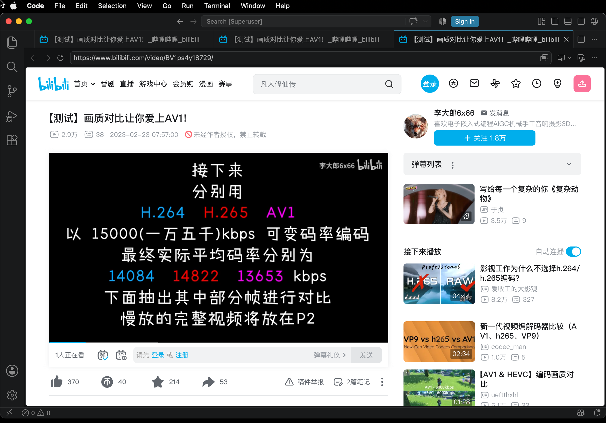

# VSCode/Bilibili video playback evidence — 2026-08-01

This folder records the bounded run that separated video decode/playback from
the remaining Metal presentation failure.

## Runtime-confirmed playback

`macws-bili-layoutfix.json` navigated VSCode's current Chromium target to
`https://www.bilibili.com/video/BV1ps4y18729/` and requested muted playback.
The first sample reported `readyState=4`, `paused=false`, `error=null`, video
time `0.491010`, and 216 total frames. The final sample reported video time
`4.676808` and 339 total frames, with zero dropped or corrupted frames. This
runtime-confirms that network fetch, MSE, demux and decode were advancing; it
does not by itself prove correct displayed colors.

`macws-bili-textrace.json` is the shorter texture-trace run. The legacy
`macws-bili-probe.json` is retained because it shows the earlier page state in
which media time advanced but the frame counter remained unchanged.

## Runtime-confirmed NV12 texture shape

The device's 106 MiB `/var/jb/var/mobile/vscode.log`, lines
2477905–2477933, captured the same `420v` IOSurface used for both Chromium
textures:

```text
#### MTL_TEX/iosurf.IN pfmt=10 type=2 w=852 h=480 ... plane=0 ios=0x60003b960
####     ios: w=852 h=480 bpr=896 fmt=0x34323076(420v) elemSz=1 allocSz=657408 planes=2
#### IOSURFACE-COMPAT baseAddress plane=0 original=0x110b5c380 base=0x110b5c000 propertyOffset=0 corrected=0x110b5c000 recovery=11
#### MTL_TEX/iosurf.OUT -> 0x601ed4b00 (label=(nolabel))
#### MTL_TEX/iosurf.IN pfmt=30 type=2 w=426 h=240 ... plane=1 ios=0x60003b960
####     ios: w=852 h=480 bpr=896 fmt=0x34323076(420v) elemSz=1 allocSz=657408 planes=2
#### IOSURFACE-COMPAT baseAddress plane=1 original=0x110b5c380 base=0x110b5c000 propertyOffset=442368 corrected=0x110bc8000 recovery=12
#### MTL_TEX/iosurf.OUT -> 0x601ed4600 (label=(nolabel))
```

RE-confirmed in this tree: the pre-fix type-`0x82` translator discarded a real
semantic plane input even though both texture constructors returned non-nil.
`Metal_hooks.x` now carries IOSurfaceID, plane and compression span as one
lock-protected scope. Adjacent per-plane IOSurface getters are recovered from
explicit creation properties because disassembly of the macOS 13.4 and iOS
16.3 IOSurface binaries shows their field offsets differ.

The initial translator follow-up placed the scoped plane at `args+0x38`. That
was still the wrong ABI field. The project LLDB tool then traced a native iOS
process creating R8 plane 0 and RG8 plane 1 views of the same two-plane `420v`
surface. The complete trace is in `native-ios-type82-nv12.log`; its decisive
returns are:

```text
Y : type=0x82 in+30=0x00000000000000a7 in+38=0 in+50=0x180888c00
UV: type=0x82 in+30=0x00000001000000a7 in+38=0 in+50=0x180888d00
```

Runtime-confirmed: the low 32 bits at `+0x30` are the IOSurface ID and the high
32 bits at `+0x34` are the plane. `+0x38` is zero for both native calls. This
also matches the iOS IOGPU call-site instruction
`stp w0, w21, [x24, #0x30]`: `w0` is the surface ID and `w21` is the plane.
The production translator now writes that exact packed pair and clears the
incorrect shifted field instead of forcing a validation result.

## Direct-GPU A/B isolation

A sentinel-only in-process probe sampled a decoded NV12 frame twice through
one independently compiled Metal pipeline and one command buffer:

1. directly from the two external IOSurface-backed R8/RG8 textures;
2. from ordinary Metal textures populated with the exact public `getBytes`
   output of those same views.

Before the `+0x34` fix, the direct sample was green/magenta while the CPU clone
was correct. After the fix both 640×360 RGBA outputs were byte-identical:

```text
direct IOSurface SHA-256  8e62a43759486cbbe9350a548d36b35b287b061d46be2daab383df0ec74cca39
CPU clone SHA-256         8e62a43759486cbbe9350a548d36b35b287b061d46be2daab383df0ec74cca39
Y raw == Metal getBytes   96822f7b06bf6b1a90ca0e0cf4eca2bdaa3dd8518967bb09a20eb68d2a1bb2ab
UV raw == Metal getBytes  06ab559e76dfa5a2290e9bf5fe828dc3d856f79114e65a63e3e5680ea217ec50
```


This runtime-confirms that decoder output, CPU plane addressing, Metal source
compilation, the conversion shader, and generic command submission were
already sound. The corruption boundary was specifically the external
IOSurface plane resource imported with the wrong IOGPU type-`0x82` ABI.

## Production validation

The final plane fix compiled, packaged, installed, and ran with the production
preflight reporting all dump/trace sentinels off. In a bounded VSCode run the
Bilibili AV1 element reported `readyState=4`, `paused=false`, `error=null`, and
advanced from media time `132.526404` / 309 total frames to `140.866912` / 562
total frames. It recorded three dropped frames and zero corrupted frames. A
compositor screenshot from the same run shows normal colours instead of the
pre-fix green/magenta mapping:


The later interval in this particular source is a black title card, so media
time advancement there is not promoted to a dynamic-frame stability claim.
The validated interval above contains 253 newly presented frames and is the
bounded production acceptance witness. Apple's product-page animation remains
a separate integration test; this evidence does not claim that every codec,
colour space, or website-specific animation is now covered.

## Real VNC primary-plane capture

The correct Chromium DevTools screenshot still did not prove that VNC could
see the video. A simultaneous A/B showed correct, advancing video in
`Page.captureScreenshot` while the true 2388×1668 RFB frame contained a black
video rectangle. The boundary was therefore after Chromium composition and
before the WindowServer primary scanout consumed by VNC.

RE-confirmed in the exact installed Electron Framework
`4C4C4442-5555-3144-A1A8-564169F3FF00`:

```text
OverlayProcessorMac::ProcessForOverlays       image + 0x0ca10b8
CALayerOverlayProcessor::ProcessForCALayer... image + 0x0ca1254
video_capture_enabled load                    image + 0x0ca12a8
AggregatedRenderPass field                    render_pass + 0x0e2
capture result                                w20 = 0x21 at +0x0ca17f0
```

Chromium 148.0.7778.280's actual source confirms the same invariant:
`ProcessForCALayerOverlays` returns
`kCALayerFailedVideoCaptureEnabled` when that field is set, after which
`OverlayProcessorMac` preserves the root quads and appends its normal primary
plane. Replacing the whole factory with `OverlayProcessorStub` was explicitly
disproved: the real VNC client area became entirely black because the Stub did
not perform that Mac primary-plane fallback.

Production now keeps Chromium's `OverlayProcessorMac`. In the GPU helper only,
after UUID/prologue/dataflow verification, two instructions are rearranged:

```text
before: mov x23,x1;             ldrb w8,[x1,#0xe2]
after:  strb w8,[x1,#0xe2];     mov  x23,x1
```

The preceding unmodified `cmp w8,#1; b.ne` proves that `w8` is exactly one on
this fallthrough. Thus the adapter writes Chromium's real capture field; its
original `tbnz`, result selection, body, return and primary-plane fallback all
remain intact. An earlier whole-function Substrate trampoline produced three
GPU-helper exits during cold launch. The final two-instruction adapter produced
zero `GPU process exited unexpectedly` lines in the bounded cold run.

The true RFB frames below were captured three seconds apart. They are normal
colour primary-scanout frames, not CDP screenshots, and have different hashes:

```text
vscode-bilibili-vnc-primary-03.png
  5d0ad9ce784aefa6c638e14f09d51d0f3ef1aa91d02edac9a23d50f2c4819013
vscode-bilibili-vnc-primary-06.png
  8f604d822b46ac8dc5856b9a1523a1ca222fd3eb12602b53c621c065977d2146
```




The matching observe-only CDP record is
`vscode-bilibili-vnc-primary-cdp.json`. Across four seconds it reported
`paused=false`, `readyState=4`, `error=null`, media time
`72.2603 → 76.757731`, total frames `2173 → 2307`, dropped frames
`33 → 35`, and corrupted frames fixed at zero. Together with the visible RFB
frames, this runtime-confirms both playback progress and VNC presentation.

## Generation-1 command wrapper follow-up

The first bounded run after Safari's compiler-service isolation produced an
IOGPU error archive for Code Helper GPU PID 86614. Its manifest matched error
`0x102` to serial 2 and recorded:

```text
serial=1 fixed=1 commands=2080 segments=304
serial=2 fixed=0 commands=2160 segments=328 matched=YES
serial=3 fixed=0 commands=2136 segments=328
```

The archived serials have the following SHA-256 witnesses:

```text
serial 2 KCMD     c34d36f1026f945224bd266ce67eff689878bdcdbcb4925afb2df710d99b1f43
serial 2 segments 83b185979a96adebe2de007a53827c93962e7ce4f10aea6cf0a84280cb221d76
serial 3 KCMD     ba26f85576b4b1220552a3e3dd1f676d57560740b1e1f57fc94ca35f4df9f3eb
serial 3 segments 640ae8d1b1b0e0f1c0e7200a27300742c099bd835034d2c2f16fb98b54dc410f
```

`parse_agx_segment_list.py` runtime-decodes both records as trailing-wrapper
generation 1, with equal outer/tail generation fields, exact subtype-1
payload range `0x0..0x840`, and type-3 opcode `0x9b03`. Serial 2 carries two
wrapper records over `0x840..0x870`; serial 3 carries one over
`0x840..0x858`. Generations 0 and 2 through 4 already had independent runtime
witnesses, so the translator now admits the bounded, fully observed family
0 through 4 while retaining every structural/range/opcode validation. This is
an upstream ABI adaptation, not a return-value or error-check bypass.

The updated library was built on-device with the project's FAST_FORCE path,
installed without reboot/respring, and passed the chroot smoke test. In the
next 15-second Bilibili probe, decode/presentation counters advanced as
follows:

```text
sample 0:  currentTime=4.005  totalVideoFrames=124 dropped=3
sample 15: currentTime=12.088 totalVideoFrames=366 dropped=3
sample 30: currentTime=20.244 totalVideoFrames=611 dropped=3
```

All samples had `readyState=4`, `paused=false`, `error=null`, and
`corruptedVideoFrames=0`. This runtime-confirms that the generation-1 miss was
a real freeze/completion blocker. It does not validate colour correctness.

The same run also logged a separate Skia shader failure:

```text
Internal error while linking shader. MSL compilation error:
This library format is not supported on this platform (or was built with an old version of the tools).
```

A standalone source-library probe still returned real `_MTLLibrary` and
`_MTLFunctionInternal` objects, so the compiler bridge was not globally dead.
Subsequent UUID-locked request/reply observation found two upstream target
sources instead: an old cache populated with `air64-apple-ios16.3.0`, and the
exact ANGLE 1ba8ec3 default library embedded as
`air64-apple-macosx10.14.0`. Production now records a cache schema marker and
invalidates only the two regenerable Metal cache index/data files when that
schema changes.

The package also carries ANGLE 1ba8ec3's same generated default-shader source
compiled by the real service through the MacWS macabi request adapter. The
runtime substitution is deliberately byte-exact:

```text
upstream ANGLE library  bytes=361943 FNV-1a-64=4a17e801057d2e72
macabi replacement      bytes=714152 FNV-1a-64=2b19e550c422772a
```

Only the first exact length/hash pair is replaced; every different Electron
or ANGLE library is forwarded unchanged. This keeps Safari's native compiler
requests outside the MacWS request scope and avoids the global target-OS or
renamer bypasses that previously broke Safari.
