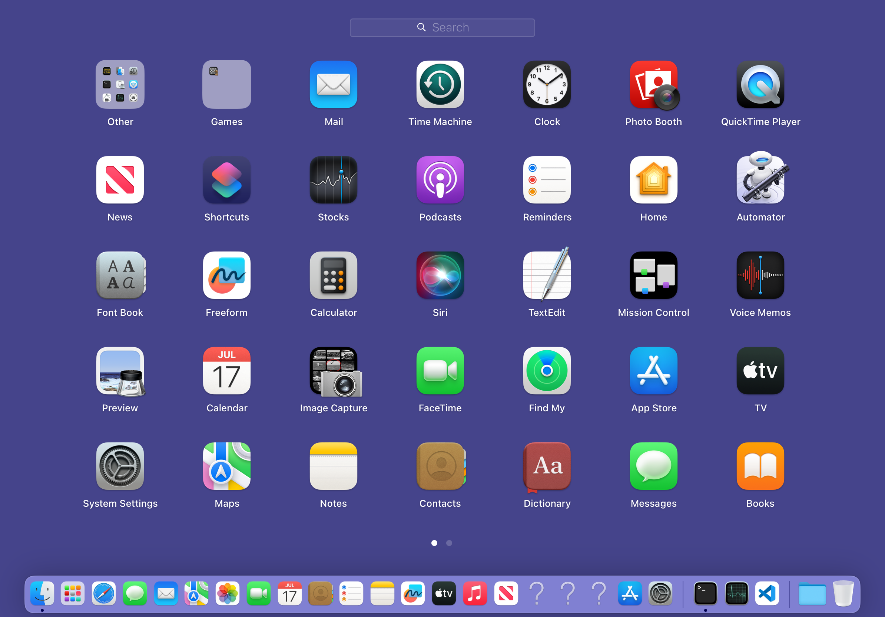
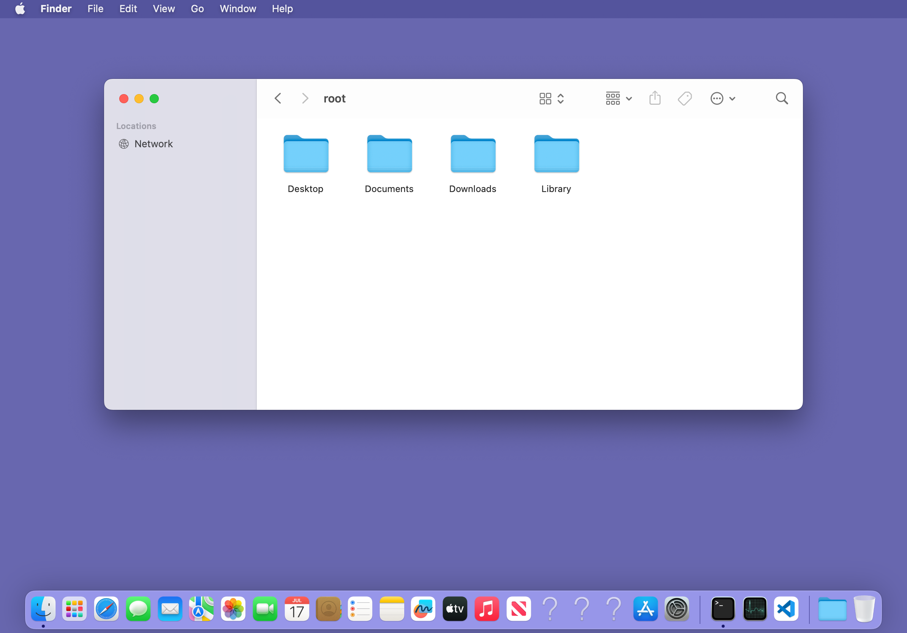

# Finder and IconServices chroot-root volume milestone

Date: 2026-08-04
Target: iPad13,6, iPadOS 16.3.1, macOS 13.4 chroot, AGX-native production profile

This milestone fixes the shared filesystem invariant behind three visible
regressions: Finder terminated during startup, Launchpad could become empty,
and Dock/IconServices returned transparent or placeholder icons. The repair is
at the chroot mount/boot-volume boundary; it does not suppress a crash, force a
registration result, or manufacture Finder/IconServices objects.

## 1. Two consecutive failures, not one crash

The first Finder and `iconservicesagent` failures recursively finalized newly
allocated 320-byte CoreServicesInternal FileCache objects until the stack
guard. The object address changed at every level and the metadata repeated in
a four-node cycle, disproving a same-object double release. The original crash
is preserved as
[`Finder-filecache-recursion.ips`](evidence/finder-iconservices-root-volume-20260804/Finder-filecache-recursion.ips).

Runtime tracing of the real providers showed two namespace leaks:

- `statfs("/")` exposed the host mount name `/private/var` even though the
  process-visible mount point is `/`;
- the kernel file-ID path API and CoreServices volume properties could walk
  outside the chroot root.

Applying the complete root mount model to Finder removed that recursion and
exposed the next independent failure. Finder then crashed in
`TFSVolumeInfo::SamePhysicalDevice` with `x0 == 0`; that report is
[`Finder-null-volume-peer.ips`](evidence/finder-iconservices-root-volume-20260804/Finder-null-volume-peer.ips).

## 2. Actual DesktopServicesPriv RE

The exact macOS 13.4 cache image is
`DesktopServicesPriv c76ab28e-02a7-3d20-a294-9dabb94c4313`. Bytes were read
from the target cache mapping, not from a different host framework.

RE-confirmed offsets:

```text
DesktopServicesPriv+0xe8374  ldr x0, [sp, #0x1100]
DesktopServicesPriv+0xe8378  mov x1, x19
DesktopServicesPriv+0xe837c  bl  +0xe8f3c

DesktopServicesPriv+0xe8f3c  pacibsp
DesktopServicesPriv+0xe8f50  ldr x20, [x0, #0x200]   // crash, x0 == 0
```

The shared pointer at `sp+0x1100` comes from `+0xe9648`. That function asks the
real global volume hash table at `+0xef968` for the key, and emits an empty
shared pointer when the lookup returns nil. A diagnostic-only exact-UUID hook
recorded the unchanged map boundary:

```text
LMGetBootDrive native=-100 root-CFURL=-101
find map=... result=0x0 map=[..., bucket_count=2, ..., size=1, ...]
SamePhysicalDevice lhs=0x0 rhs=...
```

The hash-table lookup itself reads the signed volume reference number from
key offset `+0x30` and its kind byte from `+0x38`. Its one existing node had
vRefNum `0`, kind `1`; the real root lookup used vRefNum `-101`, kind `0`, so
returning a fake node would have hidden a genuine missing boot-volume
classification.

Earlier in `InitializeFileSystemVolume`, the actual code calls the boot-drive
provider, compares the low 16 bits with the volume being initialized, and sets
the boot-volume byte only when they match (`+0xe8280..+0xe829c`). CarbonCore is
not chroot-aware: it returned the iOS host boot volume `-100`, while
`_kCFURLVolumeRefNumKey` on the process-visible `/` returned `-101`. That
mismatch sent the first real chroot volume down the peer lookup above.

## 3. Upstream repair

`LMGetBootDrive_new` now derives the logical boot drive from the exact CFURL
volume-refnum property used by DesktopServices itself. It returns the native
CarbonCore value only if the process-visible root cannot provide a refnum. The
root value is cached after the first successful query.

The statfs/fsgetpath/CFURL namespace compatibility is production-scoped to the
processes that own or consume the application/desktop catalog:

- Dock
- Finder
- `iconservicesagent`
- `iconservicesd`
- lsd
- launchservicesd

Other AppKit processes retain stock kernel entry points. This preserves the
earlier Terminal fork fix: installing the `fsgetpath` trampoline in every GUI
process had dirtied a neighboring libsystem kernel page and broken child
startup after `fork`.

The successful Finder A/B recorded:

```text
LMGetBootDrive native=-100 root-CFURL=-101 effective=-101
SamePhysicalDevice diagnostic count = 0
Finder pid=12978, state=running at 12 seconds
Finder crash count 25 -> 25
```

After rebuilding without diagnostic environment variables, the production
Finder job remained running as PID 13496 past 25 seconds with no new crash.
Its log contained zero `####` debug lines.

## 4. Visible and service witnesses

The production IconServices jobs were rolled independently; iOS's native
`iconservicesagent` was not touched:

```text
com.macwsguide.iconservicesd      pid=13781 state=running
com.macwsguide.iconservicesagent  pid=13811 state=running
iconservicesagent crash count     25 -> 25
```

The chroot Dock then restarted as PID 13966 without a Dock crash. The stock
Launchpad UI populated with real application icons:



MacWS Host's normal Finder action created the real `/Users/root` browser
window, with `Desktop`, `Documents`, `Downloads`, and `Library` folder icons:


The three `?` items still visible in Dock are not transparent-texture
failures. `defaults read com.apple.dock persistent-apps` identifies them as
Keynote, Numbers, and Pages entries whose `/Applications/*.app` targets are not
installed in this rootfs. They were deliberately left in the user's Dock
configuration.

Throughout the isolated runs `/var/mobile/.eksafemode` remained absent,
SpringBoard stayed on the same PID, the thermal state remained `nominal`
(32.8–33.0 °C), and no reboot or respring was performed.

## 5. Final publication gate: signed bytes need a fresh vnode

The last hot deployment initially introduced a separate packaging failure.
Finder reached dyld with `DYLD_INSERT_LIBRARIES` set, then died before any
libmachook constructor with `SIGKILL - CODESIGNING / Invalid Page`. This was
not the non-enforcing AMFI launch-constraint notice. The preserved report is
[`Finder-invalid-page.ips`](evidence/finder-iconservices-root-volume-20260804/Finder-invalid-page.ips).

The report places the invalid address at the first page of a 528 KiB mapped
file. The installed arm64e `libmachook.dylib` was 535,456 bytes, which rounds
to that exact mapping size. Reading that same file through on-device `ldid`
reproduced the same first-page Invalid Page termination; its report is
[`ldid-invalid-page.ips`](evidence/finder-iconservices-root-volume-20260804/ldid-invalid-page.ips).

This runtime evidence matches the production install invariant already
implemented by `misc/build_on_ios.sh` and `layout/usr/macOS/bin/postinst.sh`:

1. apply `LC_BUILD_VERSION` and every other byte mutation first;
2. sign each fresh lipo slice twice for this on-device ldid build;
3. add only the final CDHash to the trustcache;
4. unlink or move the old destination before copying, so the published image
   receives a new inode and cannot inherit a stale kernel csblob.

The repaired arm64e and arm64 images were both parseable through `ldid -h`
after publication. A new arm64e `/bin/bash` injection printed `final-smoke`,
Finder PID 17919 remained running with no new crash and no `####` diagnostics,
and the normal `macwshost://finder` action created the real browser window:



The invalid images remain recoverable on the device under
`/var/jb/var/mobile/libmachook-backup-invalid-page-20260804-1435`; the 25 old
Finder reports were moved, not deleted, to
`/var/jb/var/mobile/macws-crash-archive-20260804/finder-before-final-signature`.

## 6. Diagnostic switches

The following switches are observation-only and absent in production:

- `MACWS_APP_MOUNT_COMPAT_DIAGNOSTIC`
- `MACWS_APP_MOUNT_TRACE`
- `MACWS_FILECACHE_DIAG`
- `MACWS_DESKTOPSERVICES_DIAG`

The temporary Finder launch plists were unloaded and moved to the recoverable
device directory `/var/jb/var/mobile/macws-finder-diagnostics-20260804`.
Only `com.macwsguide.finder-desktop.plist` remains in the production GUI
launch directory.
