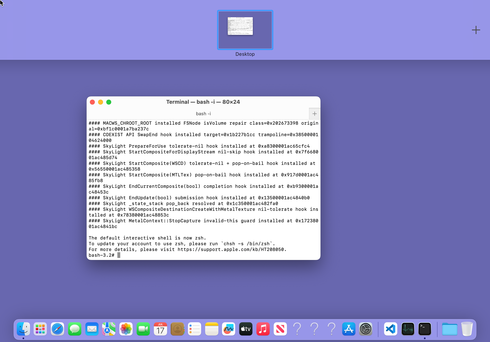
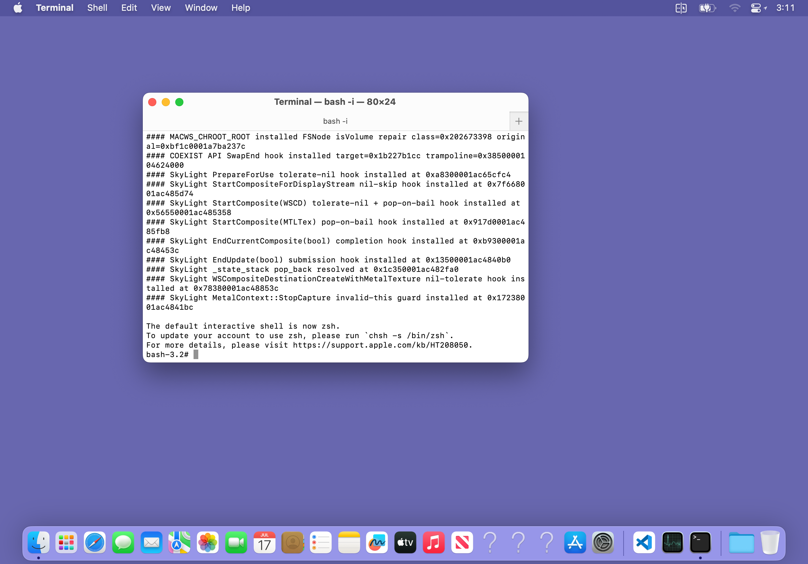

# Fullscreen Mission Control input — 2026-08-08

## Result

The fullscreen three-finger path now preserves Dock's native fluid Mission
Control animation without allowing stale `Changed` samples to accumulate on
Dock's main queue. Fullscreen pointer input now enters WindowServer's global
hit test through Dock's CGS-connected endpoint, so a visible Mission Control
card can be selected in its compositor-transformed position.

This is the same ownership boundary used by a physical display or the working
OSXvnc mouse path. It does not infer a captured application's local `NSWindow`
coordinates from a Mission Control frame.

## Root-cause evidence

Runtime A/B on the iPad showed that an OSXvnc global click at framebuffer
point `(900, 800)` selected Terminal and exited Mission Control while the old
Host route did not. The old route first resolved a captured DisplayStream
layer and then delivered application-local input. Mission Control's visible
card position is a WindowServer/Dock compositor transform, not that
application window's current local AppKit frame.

The gesture producer could send UIKit samples at 120 Hz. The old Dock endpoint
created one main-queue block for every `Changed` record. When Dock was busy
rendering Mission Control, those blocks represented historical progress and
could outlive the finger position. The replacement keeps every Begin and
terminal transition, but stores only the newest pending Changed record behind
at most one main-queue drain.

## Implementation

- `MacWSHost` classifies fullscreen pointer records as one hardware-style
  desktop stream. It targets the live Dock endpoint, encodes window zero, and
  preserves the complete framebuffer coordinates.
- `macwsinputd` accepts that specific zero-window system-surface contract only
  for pointer kinds and forwards it to the named process-local endpoint.
- Dock's injected AppInput endpoint calls the proven `CGPostMouseEvent` route.
  WindowServer remains responsible for the live global hit test.
- Dock system-gesture Changed records use a session/contact-aware latest-value
  coalescer. Begin, the newest final Changed, End, and Cancel stay ordered.
- `misc/host_gesture_probe.py --global-system-surface` provides a bounded
  reproduction of the zero-window route.

No assertion, validation, abort, or Objective-C method was bypassed.

## Device validation

The production package was fully rebuilt and installed; all three changed
binaries compiled and linked. The protocol validator passed with
`-Wall -Wextra -Werror`.

The bounded diagnostic session used native AGX, a 2388x1668 Retina VNC frame,
and the real Dock process:

```text
WindowServer 33053
Dock         33347
Terminal     33404
```

The same PIDs were present before and after selection. No crash report was
created during the session. A 120 Hz, 0.8 second upward stream reported:

```text
#### APP-INPUT DOCK-GESTURE-COALESCE pid=33347 received=95 delivered=90 coalesced=5
```

The zero-window click then reported:

```text
#### APP-INPUT SYSTEM-POINTER pid=33347 window=0 kind=6 buttons=0/0 appkit=(450.00,434.00) quartz=(450.00,400.00) exact-start=YES exact-continuation=NO result=0/0
#### APP-INPUT DOCK-SYSTEM pid=33347 window=0 kind=6 pixel=(900.00,800.00)/2388x1668 logical=(450.00,434.00) quartz=(450.00,400.00) route=system-mouse posted=YES
```

Mission Control after the native continuous gesture:



The same desktop after the zero-window global click selected Terminal:



The session was stopped explicitly after validation. The final thermal sample
was `nominal`, 32.79°C, and the iPad returned to iOS without respring or reboot.

## Reproduction

With a diagnostics-enabled GUI session already running:

```bash
dock_pid=$(launchctl list | awk '$3 == "com.macwsguide.dock" {print $1}')
python3 misc/system_gesture_probe.py \
  --target-pid "$dock_pid" --progress -0.85 --duration 0.8 --rate 120
python3 misc/host_gesture_probe.py tap \
  --pid "$dock_pid" --window 0 --width 2388 --height 1668 \
  --x 900 --y 800 --global-system-surface
```

These probes are diagnostics only. Physical iPad testing must still confirm
finger-to-animation feel because synthetic records cannot measure UIKit touch
sampling, display presentation latency, or the user's perceived tracking.
