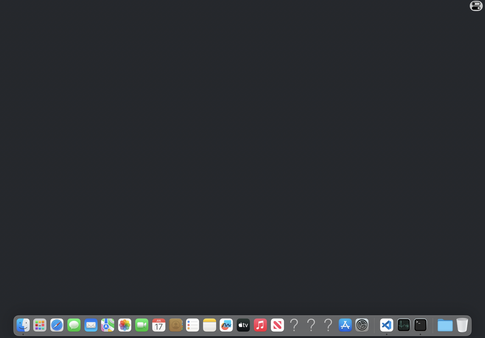
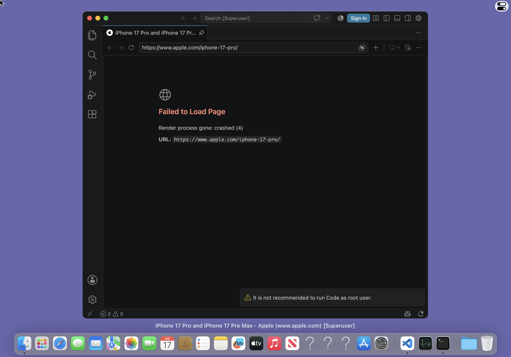
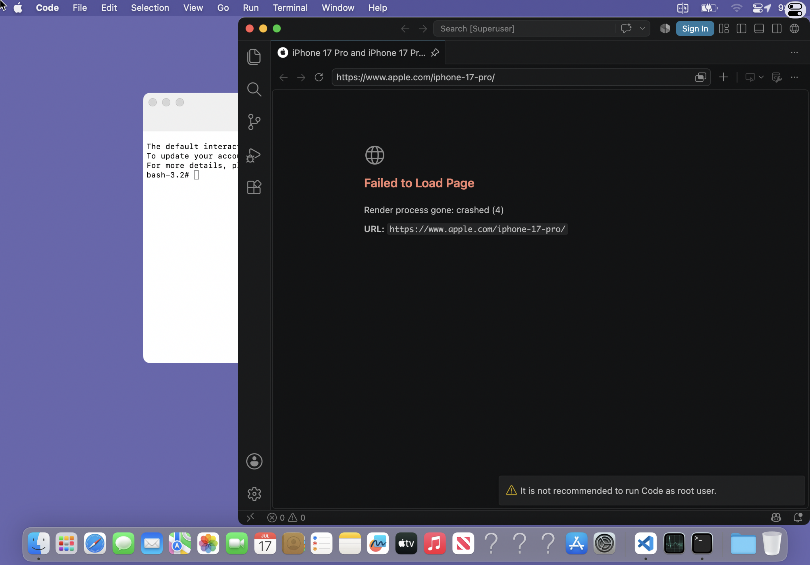
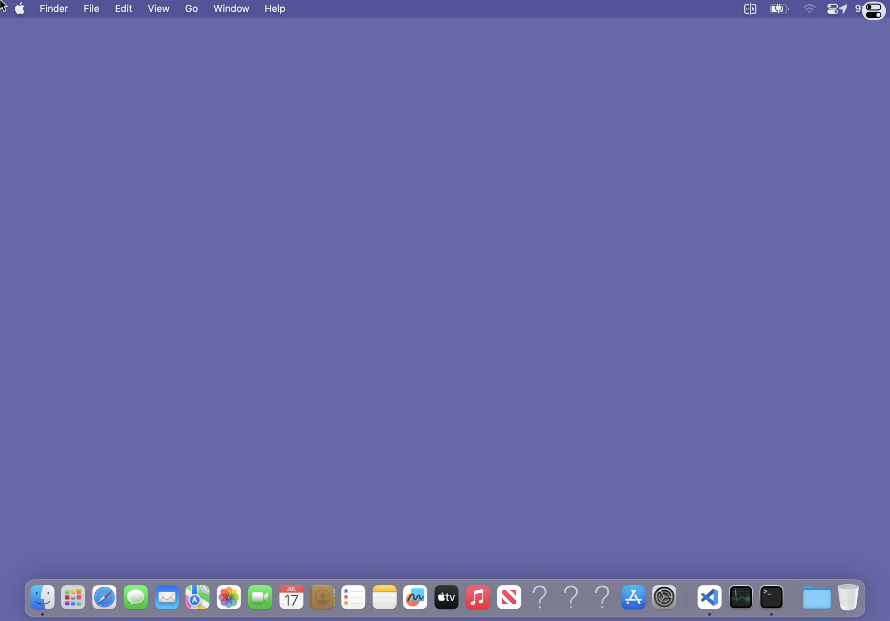

# Fullscreen three-finger state and retained-layer recovery (2026-08-09)

## Result

The fullscreen three-finger path now preserves one native Dock gesture from
UIKit `Begin` through `End`/`Cancel`, including scene and stream-mode changes.
Horizontal Space switching completed three consecutive `1 -> 2 -> 1` cycles,
and vertical App Expose returned to the desktop with both Terminal and VSCode
still visible. No private replacement animation or Host-side task switcher is
used: the records still drive Ventura Dock's real fluid-gesture controllers.

This closes two user-visible failures that had appeared related but occurred at
different layers:

- slightly diagonal downward movement could remain unclassified, or a native
  Dock session could lose its terminal record when the fullscreen scene
  changed;
- after Dock completed correctly, displayd could retain and resume the real
  `CGDisplayStream`, while Host permanently rejected its new frames as belonging
  to the retired generation. The current Space was correct and the macOS
  windows were still onscreen, but the iPad showed only the desktop and Dock.

## Runtime-confirmed failure

The rejected production run returned to Space 1 and
`macwsworkspacectl list-windows` reported both Terminal and VSCode as
`onscreen=yes`. At the same instant displayd reported the same retained stream
returning:

```text
MACWS-DISPLAY workspace-layer-remove layer=23 stream=15 through=207
MACWS-DISPLAY layer-retire-cancel layer=23 reason=window-returned
MACWS-DISPLAY layer-retire-cancel layer=9 reason=window-returned
```

Host's performance snapshot nevertheless contained only the Dock layer:

```text
layers=[layer=8/pid=60930/stream=5/sequence=61/surface=348/age-ms=79121.86]
```

This is runtime confirmation that Dock/SkyLight had restored the windows while
the Host display graph had not. The corresponding failed-frame witness is:



## Protocol repair

A `layer_removed` event now carries the exact producer `stream_id` and the last
detached `sequence`. Host applies an ordered cutoff:

- the same stream at or below the cutoff is a delayed pre-removal frame and is
  rejected;
- the same stream above the cutoff is an explicit retained-stream return and is
  accepted;
- a different stream ID remains an authoritative new generation.

displayd republishes the retained real IOSurface whenever a retiring layer
returns to the authoritative SkyLight catalog, even when its bounds and level
are identical. This avoids restarting a valid `CGDisplayStream`, does not admit
stale frames, and removes the previous permanent same-stream tombstone.
`MacWSStreamFrameSupersedesLayerRemoval` is a pure boundary function covered by
the protocol test.

## Native gesture lifecycle and latency

Host now latches the Dock PID, framebuffer dimensions, contact ID, last
progress and velocity at the gesture's first accepted sample. Changed and
terminal records use that immutable endpoint instead of re-resolving Dock from
a capture graph which legitimately changes during Mission Control. Stream
suspension and scene reconfiguration send an explicit native `Cancel` before
clearing state, even if ordinary pointer input has already been disabled.

The injected input bridge also treats a new `Begin` as a strict ownership
boundary: if transport loss left an older contact active, it delivers a real
`Cancel` built from the last valid record before delivering the new `Begin`.
This is a defensive lifecycle invariant, not evidence that Dock was stuck in
the inspected failure; pre-fix LLDB inspection showed
`DOCKGestures._currentHandler = 0` and phase `0` after cancellation.

After the hardware-sized recognition slop, the dominant axis is selected
deterministically; an exact tie selects vertical. The previous additional 12%
dominance gate could leave ordinary diagonal down-swipes unrecognised.

For rendering latency, fullscreen reconciliation no longer performs an unused
application-only `CGWindowListCopyWindowInfo` scan on every 60 Hz gesture
sample. Its post-input sampling tail extends only while authoritative SkyLight
presentation geometry continues to change, in 100 ms increments with a hard
800 ms bound. This captures Dock's native spring without turning one gesture
into permanent high-frequency polling.

## Production validation

Validation used native AGX production coexist mode, diagnostics disabled, VNC
disabled, and the iPad thermal state remained nominal at 35 C.

Vertical down and reverse completed the native App Expose animation. The final
Host graph contained 13 real layers, including Terminal layer 9 and VSCode
layer 23, and both remained visible:





Horizontal validation first sent a cancelled partial gesture, which stayed on
Space 1, then completed three consecutive cycles:

```text
baseline-space=1
cancel-space=1
cycle=1 away-space=2
cycle=1 home-space=1
cycle=2 away-space=2
cycle=2 home-space=1
cycle=3 away-space=2
cycle=3 home-space=1
```

The adjacent desktop is expected to be empty. Returning home preserved the
same WindowServer, Terminal and VSCode processes, produced no new crash report,
and restored both application layers in Host:




The final installed production package is
`com.kdt.macosbooter_0.3.4_iphoneos-arm64.deb`, SHA-256
`c61d8087e0dcf303774ef10cb01e84dba1812d20a4526c5cd407b02c99bb112e`.
It was installed without reboot or respring. The GUI stack was stopped after
the bounded run so the device does not retain test load.
