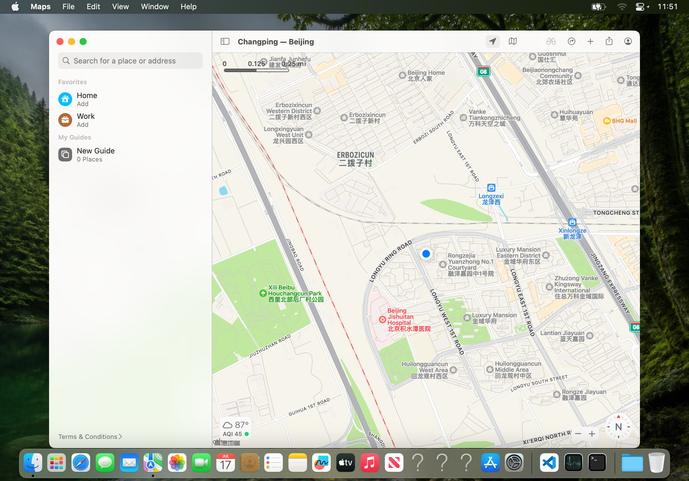
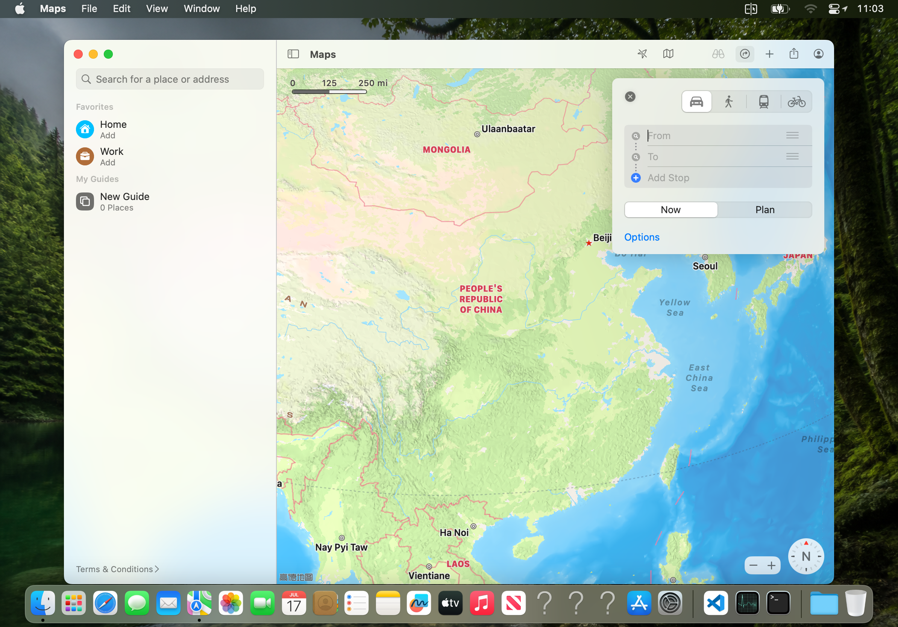
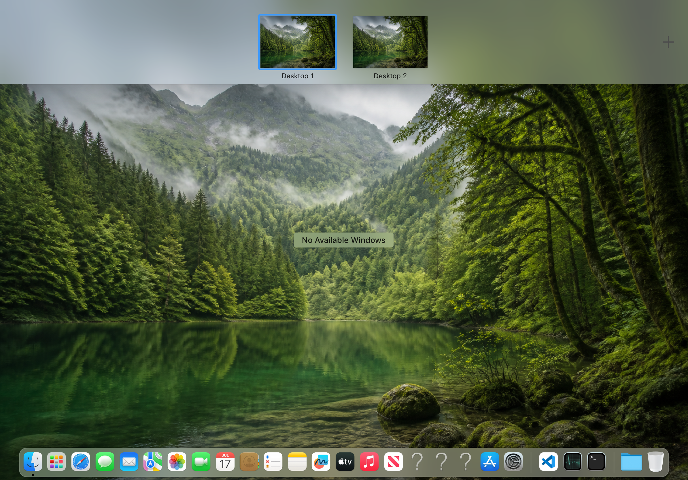
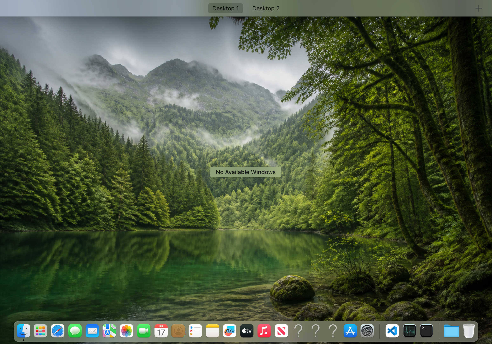

# Cold Maps, native Desktop effects, and production startup (2026-08-09)

## Scope

This milestone closes four independent cold-generation failures without
replacing macOS UI or GPU work with Host-side substitutes:

1. the LaunchServices payload and HIServices XPC executable could be absent
   from Dopamine's reboot-volatile trustcache;
2. Maps could see a real provider but retain authorization status `0`;
3. Mission Control and Maps route chrome reached two previously unseen Ventura
   QuartzCore AIR modules that iOS AGX rejected as the wrong target OS;
4. native Space and wallpaper IPC ran before Dock owned the session, so a cold
   start could remain indefinitely at environment repair.

The accepted path still uses Ventura Maps, CoreLocation, Dock, SkyLight,
CoreAnimation, and the iPad's native AGX driver.

## Cold trust is an explicit startup closure

The on-disk signatures survive a reboot; Dopamine's dynamic trustcache does
not. The former preflight validated only the chroot shell, so it could miss a
late executable used by a synchronous GUI service.

The exact Maps freeze was runtime-confirmed by a 783-sample main-thread trace:

```text
-[NSApplication updateWindows]
  +[NSTextInputContext currentInputContext_withFirstResponderSync:]
  -[NSTextInputContext activate]
  MyActivateTSMDocument
  TISGetRomanSwitchState
  HIS_XPC_GetCapsLockLanguageSwitch
  _SendMessageToHISService
  xpc_connection_send_message_with_reply_sync
```

The stock Ventura HIServices XPC target had CDHash
`a3de6a22d8fdfa40e0f4e0e7bc5f34f5f6139095`; it was missing from the cold
trustcache. Registering that exact existing CodeDirectory and starting the
stock service released every queued click. This is a service-readiness fault,
not an input-coordinate fault.

`macos_gui.sh` now restores a bounded, explicit closure before its chroot
probe: shared-cache CodeDirectories, project loaders/hooks, LaunchServices,
WindowServer, Aqua workspace owners, HIServices, CoreLocation/GeoServices,
the interop daemons, and installed VSCode executables. It does not re-sign or
modify those files. The package post-install path also trusts the already-
signed `launchservicesd.dylib`, which the thin loader must `dlopen` before
autosignd can exist. The loader now identifies the payload by exact dyld image
path, validates every Mach-O load-command bound, and fails cleanly if there is
no valid `LC_MAIN` rather than jumping through a guessed image index.

HIServices no longer inherits renderer-only AGX environment variables. Its
job is application/input metadata, and the production process remains a small
service instead of eagerly loading IOGPU and AGXMetal.

## Maps readiness includes authorization readback

The real provider callback remains the first invariant:

```text
MACWS-INTEROP Ventura location provider readiness published
MACWS-INTEROP Ventura CLLocationManager output ready
```

The readiness marker contains only the interop PID. The Catalyst launcher
checks that PID is live and that `proc_pidpath` matches one of the two exact
mount-namespace aliases of the packaged executable. Runtime on the cold iPad
showed that the iOS-side launcher sees
`/private/var/mnt/rootfs/usr/local/libexec/.../macwsinteropd`, while the process
inside the chroot sees `/usr/local/libexec/.../macwsinteropd`.

Provider readiness alone was not sufficient. Maps logged:

```text
Showing Location Services Authorization Prompt with no handler, forceAlways => NO
```

The old bridge logged `Maps authorization ready` after the private setter's
reply, but a read-only query of the exact Ventura service returned:

```text
bundle=com.apple.Maps authorization-status=0
```

Running the same stock setter followed by the same getter returned:

```text
bundle=com.apple.Maps authorization-update=ok
bundle=com.apple.Maps authorization-status=3
```

The production bridge now enforces that sequence itself. A setter reply is no
longer readiness: it immediately calls
`getAuthorizationStatusForBundleID:orBundlePath:replyBlock:` and accepts only
wire status `3` or `4`. Any error or other value tears down that control
generation and enters the existing bounded 11-second retry. Every callback is
also tied to the NSXPCConnection generation that issued it, so an old
locationd reply cannot mark a replacement connection ready.

A second runtime test showed that the stored status is not sufficient for a
new Maps application generation. After relaunch, the getter still returned
status `3`, but the new Maps PID logged the no-handler authorization prompt and
received no fixes. Replaying the same stock setter while that exact PID was
alive immediately made stock locationd deliver fixes to `com.apple.Maps`.
`macwsinteropd` therefore observes the real
`NSWorkspaceDidLaunchApplicationNotification`, waits a bounded two seconds for
Maps to establish its AppKit/CoreLocation identity, then performs a fresh
set-and-readback transaction for that live PID. It also enumerates an already
running Maps process when the bridge itself is replaced during a package
upgrade.

After status `3`, the unmodified Ventura locationd repeatedly emitted:

```text
{"msg":"Sending location to client", "client":"com.apple.Maps", ...
 "referenceFrame":"WGS84", "type":"WiFi",
 "fromSimulationController":true, "desiredAccuracy":"-2.0000"}
```

The final installed-package test launched a new Maps PID and, without invoking
the diagnostic `locationd_control` helper, recorded:

```text
MACWS-INTEROP refreshing Maps authorization for application pid=20475
MACWS-INTEROP Ventura location services and Maps authorization verified status=3
```

The VNC witness shows populated map content, the stock blue current-location
marker, and a successful current-location-button update. Coordinates are
intentionally omitted from the repository.



## Desktop effects require twelve exact macabi AIR modules

Mission Control first exposed the fragment function
`single_pass_blur_3_lph`. A bounded `macwsworkspacectl create-space` call
created a real third managed Space while WindowServer and Dock remained alive,
separating the SkyLight mutation from the native transition's render failure.
The real Mission Control transition then reached this pipeline:

```text
label=com.apple.coreanimation.draw.Pw40aXm_Tsb3A2Xhf_Isrc
vertex=downsample_blur_vert_lph
fragment=single_pass_blur_3_lph
result=0x0
errorDomain=AGXMetal13_3
errorCode=3
description=Target OS is incompatible.
```

Maps route chrome exposed a second and structurally different path. Exact
crash report `WindowServer-2026-08-09-134951.ips`, incident
`944AFB88-2054-46E9-8506-8F102F2388AD`, records:

```text
namespace=COREANIMATION
tile_pipeline=MTLPixelFormatBGRA8Unorm_tile_downsample_4
Target OS is incompatible.
```

The triggered stack is:

```text
CA::OGL::MetalContext::get_tile_pipeline
CA::OGL::MetalContext::tile_downsample_surface
CA::OGL::BlurState::tile_downsample
CA::OGL::Context::blur_surface
```

`tile_downsample_4` is a tile AIR module, not the already-retargeted
`downsample_4_frag_lph` ordinary fragment module. Both names are present in
the exact Ventura QuartzCore library.

The secondary compatibility library now contains only the twelve functions
reached by production desktop effects:

```text
fixed_vert_lph_spc              fixed_vert_lph_gen
fixed_frag_lph_cpf              path_blit_vert_lph
attachment_clear_frag_lph       std_vert1_lph
inplace_copy_lph                downsample_blur_vert_lph
downsample_8_frag_lph           downsample_4_frag_lph
single_pass_blur_3_lph          tile_downsample_4
```

The original function names and real function constants are forwarded to the
secondary copy. The system QuartzCore library remains the default, and no
compiler result, pipeline validation, or CoreAnimation abort is bypassed.
The deterministic artifact is:

```text
bytes=1048304
sha256=909a864e28f22fd264598d2aaed29e0900ae89f562e9998d6cc31aedac36f4a9
fnv1a64=2939b64a5ca3cd91
```

After installation, the same Maps route control rendered its native
translucent panel and left the same WindowServer and Maps PIDs alive.



Mission Control also rendered through the native Dock/SkyLight path, and the
diagnostic `CGSSpaceCreate` witness created a third real Space without a
WindowServer exit. Synthetic VNC coordinates did not reliably hit Dock's
expanded native `+` control, so this milestone does not overclaim a completed
physical `+` hit test; `macwsworkspacectl` remains a diagnostic/repair tool,
not the production gesture implementation.





## Startup ordering and bounds

Native Space creation and wallpaper application now require a live Dock and
run only after LaunchServices, WindowServer, and Aqua workspace owners have
explicit process readiness. Both IPCs have a 20-second timeout plus a two-
second kill bound, so a broken session returns a concrete error instead of
leaving the UI at “检查并修复启动环境”. WindowServer-dependent recovery uses the
same ordering.

No iPad reboot or respring was used during validation. The final production
package hash and installed-process acceptance results are recorded in the
evidence README beside the screenshots.
